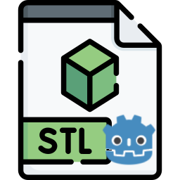

<p align="center">
  
</p>

# STL-IO
A [Godot](https://godotengine.org/)/GDScript addon to import/export STL CAD files.

[](https://www.buymeacoffee.com/valbisson)

# Setup
Copy the `addons/stl-io` directory into your addons, activate it in the plugins settings.

# Overview
This addon is pretty simple with 3 classes:
- `STLIO` has the plumbing to enable the editor
- `STLIO.Importer` for manual imports
- `STLIO.Exporter` for manual exports

# Usage
## In The Editor
STL files should be usable as `ArrayMesh` resources as soon as the addon is activated.

## Import
The importer returns either a `Variant` that is either an `ERROR` or an `ArrayMesh`.
```gdscript
var mesh :ArrayMesh = STLIO.Importer.LoadFromPath('/path/to/file')
```
`STLIO.Importer.LoadFromBytes` is also available for custom use cases.

## Export
The exporter exports all surfaces of an `ArrayMesh` to its destination.
```gdscript
var mesh :ArrayMesh = ...
STLIO.Exporter.SaveToPath(mesh, '/path/to/file')
```
`STLIO.Exporter.SaveToBytes` is also available for custom use cases.

## See Also
For more, check out the sample viewer.

## FAQ
Q: Nice icon!<br>
A: Thanks, it comes from [flaticon.com](https://www.flaticon.com/free-icon/stl_9417765)


Q: Any STL resources to share?<br>
A: [STLA Files](https://people.sc.fsu.edu/~jburkardt/data/stla/stla.html), or just [wikipedia](https://en.wikipedia.org/wiki/STL_(file_format)).


## Changelog
### 1.0.0


<details>
<summary>Previous entries</summary>

### 0.1
- first working version
</details>
